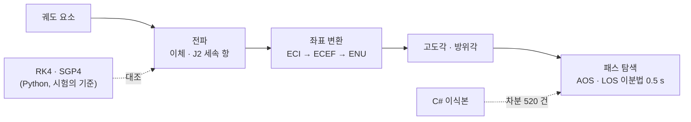

# orbit-pass-sim — 위성 패스 예측기와 그 신뢰성 시험

[](https://github.com/Haejyn/orbit-pass-sim/actions/workflows/ci.yml)
[](https://sonarcloud.io/dashboard?id=Haejyn_orbit-pass-sim)

위성 궤도를 전파해 지상국(대전)에서 **위성이 언제 보이는지**(패스 — AOS · LOS · 최대 고도각)를 예측하는 시뮬레이터다(Java 21, C# 이식본).
만드는 것보다 **그 예측이 얼마나 맞는지를 증명하는 시험 체계**에 무게를 뒀다 — 요구사항을 판정 기준으로 쓰고, 정답을 구현 밖에서 가져오고, 시험 자체의 검출력을 잰다.

```
$ java -cp build/classes orbitsim.Main          # ISS 급 궤도(420 km, 51.6°), 최소 고도각 10°
orbit: a=6798.1 km  T=93.0 min  station=Daejeon  minElev=10 deg
passes in 24h: 5
  AOS    1752s  LOS    2132s  dur   380s  maxEl  38.4 deg
  AOS    7594s  LOS    7885s  dur   291s  maxEl  18.7 deg
  ...
```

## 한눈에

- **모델의 한계를 숫자로 안다** — 표준 궤도 모델 SGP4 와 대조하니 이체 모델은 ISS 급 궤도에서 24 시간 뒤 **1,118 km**, 대전 패스의 AOS 가 최대 **103 초** 어긋난다. J2 섭동을 더하면 ISS 는 1.28 배 좋아지지만 태양동기 궤도는 오히려 나빠졌다 — "섭동을 넣으면 정확해진다" 가 아니었다
- **정답을 구현 밖에서 가져온다** — 해석해 · 물리 보존량 · Python RK4 수치 적분 · SGP4, 그리고 같은 명세로 따로 만든 C# 구현과 **520 건 전부 일치**(최대 차이 약 4 ulp, 거부 사유까지)
- **결함을 먼저 찾았다** — 예제 시험 73 개가 모두 통과하던 코드에서 성질 기반 무작위 시험이 **제품 결함 2 건**(장기 전파 비수렴 · 방위각 360°)을 드러냈다
- **시험의 검출력을 잰다** — Java 시험 659 개 · C# 564 개, PIT 뮤테이션 **95.0 %**, 요구사항 추적 29/29, SonarQube 품질 게이트 통과. 같은 파이프라인이 로컬 · GitHub Actions · Jenkins 에서 돈다



## 어떻게 맞다고 아는가

| 무엇을 | 정답의 출처 | 예 · 결과 |
|---|---|---|
| 케플러 풀이 · 전파 | 해석해 · 물리 보존량 | e = 0 → E = M · 정지궤도 주기 = 항성일 · 비에너지 −μ/2a (상대오차 1e-10) |
| 전파 결과 | **Python RK4 수치 적분** (다른 알고리즘) | 궤도 5 종, 0.01 km 안쪽 |
| 모델의 유효 범위 | **SGP4** (공개 TLE + Python `sgp4`) — 제품 코드에는 없고 시험의 기준으로만 | 위치 1 h 54 km · 24 h 1,118 km, 패스 AOS 최대 103 초 · 최대 고도각 최대 14.6° |
| 관측각 | 따로 구성한 동·북·천정 기저 | 중위도 지상국의 방위각 · 고도각 |
| 구현 전체 | 같은 명세로 만든 **C# 이식본** (차분 시험) | 520 사례 전부 일치, 최대 3.64e-11 km |
| 경계 · 특이값 | 명세 범위 끝 · 바로 밖 · NaN · ±∞ · −0.0 | e = 1 거부 · i = π 허용 · −Double.MIN_VALUE 정규화 |
| 불변식 | 고정 시드 성질 기반 무작위 (최대 100,000 건) · 메타모픽 관계 | \|M\| 10³~10¹⁵ 케플러 · 1,000 년 전파 · 마스크↑ → 패스 수↓ |

## 찾아서 고친 결함

| | 무엇이었나 | 어떻게 드러났나 |
|---|---|---|
| **D-4** | 평범한 궤도(a = 12,233 km, e = 0.24)를 1 년만 전파해도 케플러 풀이가 수렴하지 않았다 — 평균 근점 이각이 커지면 double 간격이 수렴 기준보다 커져 뉴턴 보정이 진동한다 | 성질 기반 무작위 시험. [−π, π] 로 접어서 풀도록 고쳤다 |
| **D-5** | `normalizeAngle(-1e-16)` 이 반올림으로 정확히 2π — 방위각 360.0° 로 반열린 구간 [0, 2π) 계약 위반 | 기존 시험은 −1e-9 로만 확인해 놓쳤다 |
| 가설 | "가시 구간에서 궤적을 표본당 2~3 번 계산한다" 고 봤는데 실측은 1.02~1.03 회였다 | 성능 측정 — 게이트를 "표본당 궤적 평가 ≤ 1.10" 으로 세웠다 |
| 문서 | 시험 보고서가 자기 코드의 줄 번호와 인과를 잘못 적은 곳이 두 군데 있었다 | PIT 원자료(`mutations.xml`)로 확인하고, 왜 틀리게 읽었는지까지 남겼다 |

수정 전 실패 로그는 [`docs/evidence/`](docs/evidence/) 에, 원인 · 수정 · 고정한 시험은 [시험 보고서](docs/test-report.md)에 있다.

## 수치

| 항목 | 기준 | 결과 |
|---|---|---|
| 시험 | 실패 0 | **659 통과** (Java) · **564 통과** (C# 이식본) |
| 커버리지 | 라인 ≥ 90 % · 분기 ≥ 85 % | Java **93.9 % / 92.6 %** (JaCoCo) · C# **92.3 % / 93.3 %** (coverlet) — 덮이지 않은 것은 데모 CLI(`Main`)뿐 |
| 뮤테이션 (PIT STRONGER) | ≥ 80 % | **95.0 %** (287/302) — 생존 15 개 전부 판정 근거 기록 |
| 요구사항 추적 | 전 REQ 검증 | **29 / 29** — [`docs/traceability.md`](docs/traceability.md) 를 `tools/trace.py` 가 시험 결과에서 생성 |
| 정적 분석 | 0 | PMD 0 · SpotBugs 0 · [SonarQube Cloud](https://sonarcloud.io/dashboard?id=Haejyn_orbit-pass-sim) 품질 게이트 통과(버그 · 취약점 0, 코드 스멜 5 개는 판정 기록) |
| 성능 (`PassPredictor.predict`, 10 s 간격) | 표본당 궤적 평가 ≤ 1.10 | 이체 하루 창 2.3 ms · 30 일 창 92 ms, 표본당 궤적 평가 **1.006 회** |
| J2 세속 항의 효과 (SGP4 대조) | — | ISS ×1.28 개선 · 태양동기 ×0.36 악화 · 고타원 ×1.11 — 이레 창에서 이체는 3 일차, J2 는 1 일차부터 패스 개수가 어긋난다 |

## 실행

```bash
python build.py                           # compile → test → coverage → mutation → pmd → spotbugs → trace → bench
python build.py compile test              # 원하는 단계만
python tools/gen_golden_rk4.py --check    # RK4 기준 재현
python tools/gen_golden_sgp4.py --check   # SGP4 기준 재현 (sgp4 패키지가 없으면 건너뜀)
python tools/differential.py --check      # Java ↔ C# 차분 시험
```

빌드 도구 없이 JDK 21 + Python 3 만 있으면 된다(도구 jar 는 `tools/fetch.py` 가 고정 버전으로 받는다). 각 단계가 게이트다:

| 단계 | 도구 | 실패 조건 |
|---|---|---|
| compile | `javac --release 21 -Xlint:all -Werror` | 경고 1 개 |
| test · coverage | JUnit 5 · JaCoCo | 실패 1 개 · 라인 < 90 % · 분기 < 85 % |
| mutation | PIT 1.20 (STRONGER) | 검출률 < 80 % |
| pmd · spotbugs | PMD 7 · SpotBugs 4.9 | 1 건 |
| trace | `tools/trace.py` — `@Tag("REQ-…")` ↔ 명세 ↔ JUnit 결과 | 시험 없는 · 실패한 요구사항, 명세에 없는 ID |
| bench | `BenchCli` — 표본당 궤적 평가 횟수 | 1.10 회 초과 |

같은 단계를 **GitHub Actions**(ubuntu · windows × JDK 21, 골든 재현성, SonarQube Cloud 잡)와 **Jenkins** 선언형 파이프라인(`Jenkinsfile`, 8 스테이지 — [빌드 로그](docs/evidence/2026-09-15-jenkins-build-2-console.log))이 돌린다.

## 구성

| 경로 · 모듈 | 내용 |
|---|---|
| `KeplerSolver` · `OrbitalElements` | 케플러 방정식(뉴턴-랩슨), 궤도 요소와 물리적 유효성 검사 |
| `TwoBodyPropagator` · `J2Propagator` | 이체 해석해(궤도 요소 → PQW → ECI), J2 세속 항(승교점 적경 · 근지점 인수 · 평균 근점 이각 변화율) |
| `Frames` · `GroundStation` | ECI ↔ ECEF(지구 자전각), 측지 ↔ ECEF(구형 지구), 지상국 ENU 의 고도각 · 방위각 · 거리 |
| `PassPredictor` | 시간 창을 훑어 가시 구간을 찾고 AOS · LOS 를 이분법으로 0.5 s 까지 좁힌다. 궤적을 주입할 수 있어(`forTrajectory`) J2 · 외부 골든 궤적도 같은 탐색 코드로 돈다 |
| `csharp/` | 같은 명세의 C# 이식본(xUnit · coverlet) — 차분 시험의 상대 |
| `tools/` | 빌드 파이프라인 · 추적 생성 · RK4 · SGP4 골든 생성 · 차분 시험 |
| `docs/` | [요구사항](docs/requirements.md) · [시험 계획서](docs/test-plan.md) · [시험 보고서](docs/test-report.md) · [추적 매트릭스](docs/traceability.md) |

## 한계

- 섭동은 J2 세속 항뿐이다 — J2 단주기 항 · 평균 요소 변환(Brouwer), 대기항력, 세차 · 장동은 없다. 그래서 이틀 넘는 일정에는 못 쓴다(SGP4 대조로 잰 결과)
- 지구는 구형, 시각은 단순 GMST 다 — 타원체 지구(WGS-84) · 대기 굴절은 범위 밖
- C# 이식본은 같은 사람이 같은 명세로 만들었다 — 두 구현의 차이는 잡지만 **명세 자체의 오류는 못 잡는다**

## 짝 프로젝트

지상국의 일은 **언제 보이나 → 그때 받은 신호를 데이터로** 두 단계다. 이 저장소가 앞 단계(안테나를 언제 어디로 돌릴지)이고,
뒤 단계(패스 동안 받은 비트 → CCSDS 프레임 → 패킷, 실제 위성 녹음까지 복호)는 [ccsds-downlink-reliability](https://github.com/Haejyn/ccsds-downlink-reliability) 다 — 같은 방법으로 만들었다.
