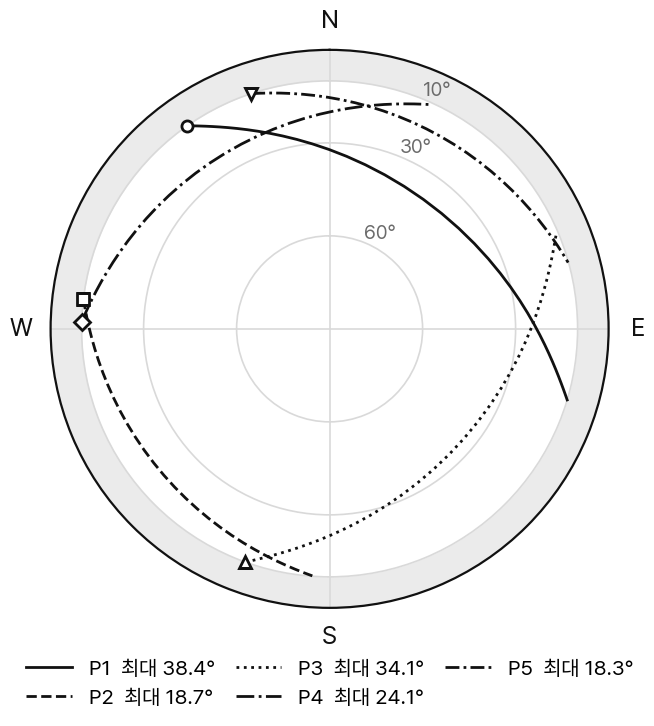
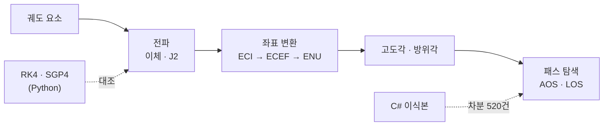
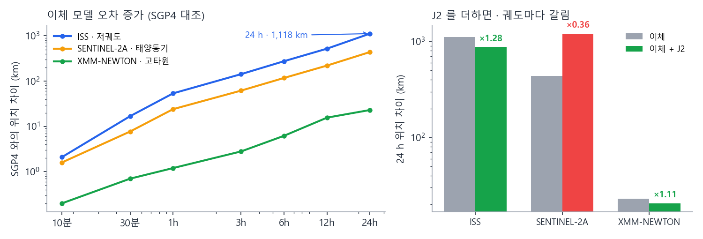
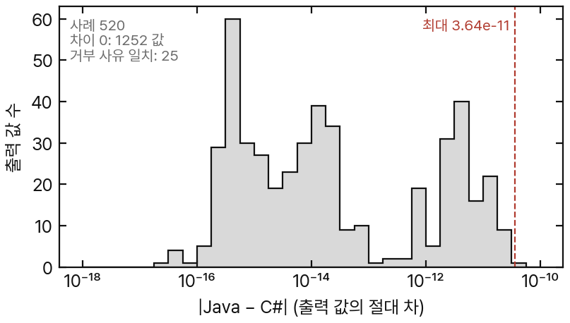

# 🌍 orbit-pass-sim

위성 궤도 전파 · 지상국 패스 예측 (Java 21, C# 이식본) + 신뢰성 시험
AOS · LOS · 최대 고도각 예측, 예측 오차 측정

[](https://github.com/Haejyn/orbit-pass-sim/actions/workflows/ci.yml)
[](https://sonarcloud.io/dashboard?id=Haejyn_orbit-pass-sim)


## 요약

- 🛰️ 패스 예측: AOS · LOS 이분법 0.5 초, 최대 고도각
- 📏 SGP4 대조: 이체 모델 24 h 위치 차이 1,118 km (ISS 급), AOS 최대 103 초
- 🔁 Java ↔ C# 차분 시험: 520 사례 일치, 최대 차이 3.6 × 10⁻¹¹ km
- 🐞 성질 기반 무작위 시험으로 제품 결함 2건 발견 (예제 시험 73개는 통과)
- 🧪 PIT 뮤테이션 95.0 % · 요구사항 추적 29/29 · SonarQube 품질 게이트 통과

## 패스 예측 예시



```
$ java -cp build/classes orbitsim.Main
orbit: a=6798.1 km  T=93.0 min  station=Daejeon
passes in 24h: 5
  AOS  1752s  LOS  2132s  dur 380s  maxEl 38.4
  AOS  7594s  LOS  7885s  dur 291s  maxEl 18.7
  ...
```

- 궤도: 원궤도 420 km, 경사각 51.6°
- 지상국: 대전, 최소 고도각 10°
- 결과: 24 h 동안 패스 5회

<sub>그림 1. 위 조건의 24 h 패스 궤적 (방위각 · 고도각, `PassPredictor` 계산값). 회색 띠는 고도각 10° 미만</sub>

<br clear="right">

## 처리 흐름



## 모델 오차


<sub>그림 2. (a) 이체 모델과 SGP4의 위치 차이 (b) 24 h 위치 차이, 이체 대 이체 + J2 (숫자는 이체 ÷ J2)</sub>

- 기준: SGP4 (공개 TLE + Python `sgp4`), 시험 기준으로만 사용
- 저궤도일수록 오차 증가가 빠름
- 패스 영향: AOS 최대 103 초, 최대 고도각 최대 14.6° 차이
- J2 세속 항: ISS 개선 (×1.28), 태양동기 궤도 악화 (×0.36)
- 7일 창: 이체 3일째, J2 1일째부터 패스 개수 불일치 → 2일 이상 일정에는 부적합

## 검증

| 대상 | 기준 | 결과 |
|---|---|---|
| 케플러 풀이 · 전파 | 해석해 · 물리 보존량 | 비에너지 상대오차 1e-10 |
| 전파 결과 | Python RK4 수치 적분 | 궤도 5종, 0.01 km 이내 |
| 모델 유효 범위 | SGP4 | 그림 2 |
| 관측각 | 별도 구성한 동 · 북 · 천정 기저 | 일치 |
| 구현 전체 | C# 이식본 차분 | 520 사례 일치 |
| 경계 · 특이값 | 명세 끝 · NaN · ±∞ · −0.0 | e = 1 거부, i = π 허용 |
| 불변식 | 성질 기반 무작위 · 메타모픽 | \|M\| 10³~10¹⁵, 1,000년 전파 |


<sub>그림 3. 같은 명세로 만든 Java · C# 구현의 출력 차이 분포</sub>

## 🧰 도구

| 용도 | 도구 |
|---|---|
| 파이프라인 | `build.py` (JDK + Python 만) · 고정 버전 jar (`tools/fetch.py`) |
| 시험 | JUnit 5 · C# 이식본 xUnit |
| 품질 측정 | JaCoCo (커버리지) · PIT (뮤테이션) · PMD · SpotBugs · SonarQube Cloud |
| 정답 기준 | 해석해 · Python RK4 · SGP4 · Java ↔ C# 차분 |
| 성능 · 추적 | `BenchCli` (표본당 궤적 평가) · `tools/trace.py` |
| 자동화 | GitHub Actions · Jenkins |

고른 이유 · 실행 시점: [도구 정리](docs/tools.md)

## 찾은 결함

| ID | 내용 | 발견 |
|---|---|---|
| D-4 | 1년 전파 시 케플러 풀이 비수렴 | 성질 기반 무작위 시험 → [−π, π] 범위로 접어 해결 |
| D-5 | `normalizeAngle(-1e-16)` = 2π → 방위각 360.0° | 경계값 시험 |
| 가설 | 표본당 궤적 계산 2~3회 예상 → 실측 1.02회 | 성능 측정 |
| 문서 | 시험 보고서 줄 번호 · 인과 오기 2곳 | PIT 원자료 대조 |

수정 전 실패 로그: [`docs/evidence/`](docs/evidence/) · 상세: [시험 보고서](docs/test-report.md)

<details>
<summary><b>📊 수치</b></summary>

| 항목 | 기준 | 결과 |
|---|---|---|
| 시험 | 실패 0 | Java 659 · C# 564 |
| 커버리지 | 라인 90 % · 분기 85 % | Java 93.9 % / 92.6 % · C# 92.3 % / 93.3 % (미커버: 데모 `Main`) |
| 뮤테이션 (PIT) | 80 % | 95.0 % (287/302), 생존 15개 판정 |
| 요구사항 추적 | 전부 | 29/29 |
| 정적 분석 | 0 | PMD 0 · SpotBugs 0 · [SonarQube](https://sonarcloud.io/dashboard?id=Haejyn_orbit-pass-sim) 통과 |
| 성능 게이트 | 표본당 궤적 평가 ≤ 1.10 | 1.006회 · 1일 창 2.3 ms · 30일 창 92 ms |

</details>

<details>
<summary><b>⚙️ 파이프라인 · 실행</b></summary>

`compile → test → coverage → mutation → pmd → spotbugs → trace → bench`

| 단계 | 도구 | 실패 조건 |
|---|---|---|
| compile | `javac -Xlint:all -Werror` | 경고 1개 |
| test · coverage | JUnit 5 · JaCoCo | 실패 1개, 라인 < 90 %, 분기 < 85 % |
| mutation | PIT 1.20 | < 80 % |
| pmd · spotbugs | PMD 7 · SpotBugs 4.9 | 1건 |
| trace | `@Tag("REQ-…")` ↔ 명세 ↔ 결과 | 누락 · 실패 |
| bench | `BenchCli` | 표본당 궤적 평가 > 1.10 |

- 로컬: `python build.py` (JDK 21 + Python 3)
- GitHub Actions: ubuntu · windows, 골든 재현, SonarQube Cloud
- Jenkins: 선언형 파이프라인 8 스테이지 ([빌드 로그](docs/evidence/2026-09-15-jenkins-build-2-console.log))

```bash
python build.py                           # 전체 파이프라인
python tools/gen_golden_rk4.py --check    # RK4 기준 재현
python tools/gen_golden_sgp4.py --check   # SGP4 기준 재현
python tools/differential.py --check      # Java ↔ C# 차분
python tools/make_readme_figures.py       # README 그림
```

</details>

<details>
<summary><b>🗂️ 구성</b></summary>

| 모듈 | 역할 |
|---|---|
| `KeplerSolver` · `OrbitalElements` | 케플러 방정식, 궤도 요소 검증 |
| `TwoBodyPropagator` · `J2Propagator` | 이체 해석해, J2 세속 항 |
| `Frames` · `GroundStation` | ECI ↔ ECEF, 측지 좌표, 관측각 |
| `PassPredictor` | 가시 구간 탐색, AOS · LOS 이분법, 궤적 주입 (`forTrajectory`) |
| `csharp/` | C# 이식본 (xUnit · coverlet) |
| `tools/` | 빌드 파이프라인 · 추적 · RK4 / SGP4 골든 · 차분 · 그림 |
| `docs/` | [요구사항](docs/requirements.md) · [시험 계획서](docs/test-plan.md) · [시험 보고서](docs/test-report.md) · [추적 매트릭스](docs/traceability.md) · [도구 정리](docs/tools.md) |

</details>

## 한계

- 섭동: J2 세속 항만 (단주기 항 · 평균 요소 변환 · 대기항력 · 세차 / 장동 없음)
- 지구 모델: 구형 지구, 단순 GMST, 대기 굴절 없음
- 차분 시험: 같은 명세 기반이라 명세 오류는 검출 불가

## 관련 프로젝트

[ccsds-downlink-reliability](https://github.com/Haejyn/ccsds-downlink-reliability): 수신 신호 → CCSDS 프레임 → 패킷, 실제 위성 녹음 복호 (C#)

## 라이선스

- 코드: [MIT](LICENSE)
- 기준 궤적의 입력 TLE: CelesTrak 공개 자료
