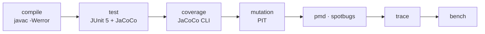

# 도구 정리

이 저장소에서 쓰는 도구 · 하는 일 · 고른 이유 · 도는 시점

- 🖥️ 로컬 = `python build.py` 또는 개별 스크립트
- ☁️ CI = GitHub Actions (`.github/workflows/ci.yml`), push · PR 마다
- 🔧 Jenkins = `Jenkinsfile` 선언형 파이프라인 (로컬 Jenkins LTS)

## 한눈에

같은 `build.py` 를 로컬 · GitHub Actions · Jenkins 가 공유 → 세 환경의 단계와 실패 기준이 같음

## 빌드 · 파이프라인

| 도구 | 하는 일 | 왜 이것 | 언제 |
|---|---|---|---|
| `build.py` | compile → test → coverage → mutation → pmd → spotbugs → trace → bench 실행, 단계별 실패 기준 적용 | Gradle · Maven 없이 JDK + Python 만으로 동작, 단계와 기준이 스크립트 하나에 보임 | 🖥️ ☁️ 🔧 |
| `tools/fetch.py` | JUnit · PIT · JaCoCo · PMD · SpotBugs jar 를 고정 버전으로 내려받기 | 저장소에 jar 를 넣지 않고 버전만 고정 | 첫 실행 시 자동, CI 는 캐시 |
| **javac** `--release 21 -Xlint:all -Werror` | 컴파일 + 경고 검사 | 경고 1개도 실패 → 경고 0 유지 | 🖥️ ☁️ 🔧 첫 단계 |

## 시험 실행

| 도구 | 하는 일 | 왜 이것 | 언제 |
|---|---|---|---|
| **JUnit 5** (console launcher 1.13) | Java 시험 659개, `@Tag("REQ-…")` 로 요구사항 표시, `@ParameterizedTest` 로 경계값 | 빌드 도구 없이 jar 하나로 실행 가능한 표준 러너 | 🖥️ ☁️ 🔧 test 단계 |
| **xUnit** · **coverlet** | C# 이식본 시험 564개 · 커버리지 | 차분 시험 상대 구현도 자체 시험과 커버리지를 갖춤 | ☁️ 차분 잡 |

## 품질 측정

| 도구 | 하는 일 | 왜 이것 | 언제 |
|---|---|---|---|
| **JaCoCo** 0.8.13 | 라인 · 분기 커버리지 (agent 로 수집, CLI 로 보고), 라인 90 % · 분기 85 % 미만 실패 | JVM 표준 커버리지 도구, SonarQube 가 XML 보고서를 그대로 읽음 | 🖥️ ☁️ 🔧 coverage 단계 |
| **PIT** 1.20 (STRONGER) | 뮤테이션 시험, 80 % 미만 실패 | 커버리지는 "실행됐다" 만 보여 줌 → "틀리면 잡는가" 측정. 생존 15개는 전부 판정 기록 | 🖥️ ☁️ 🔧 mutation 단계 |
| **PMD** 7.14 | 코드 규칙 검사 (규칙 파일 `tools/pmd-ruleset.xml`) | 소스 수준 정적 분석, 예외 규칙은 근거와 함께 파일에 기록 | 🖥️ ☁️ 🔧 |
| **SpotBugs** 4.9 `-effort:max -low` | 바이트코드 수준 버그 패턴 검사 | PMD 가 못 보는 바이트코드 패턴 (NaN 비교 · null 등) | 🖥️ ☁️ 🔧 (JDK 21) |
| **SonarQube Cloud** | 품질 게이트 (버그 · 취약점 · 중복 · 코드 스멜), PR 에 결과 표시 | 이력 관리 · PR 단위 품질 게이트, 코드 스멜 5개는 판정 기록 | ☁️ 별도 잡 (`SONAR_TOKEN`) |

## 정답 기준 (구현 밖에서 가져온 기대값)

| 도구 | 하는 일 | 왜 이것 | 언제 |
|---|---|---|---|
| `tools/gen_golden_rk4.py` | 운동방정식을 RK4 로 직접 적분한 기준 궤적 생성 (표준 라이브러리만) | 케플러 해석해와 다른 방법 → 같은 답이면 서로 검증 | 🖥️ 변경 시 · ☁️ `--check` (수치 허용 오차) |
| **sgp4** (Python) + `tools/gen_golden_sgp4.py` | 공개 TLE 로 SGP4 기준 궤적 · 패스 생성 | 표준 궤도 모델 → 이체 모델의 유효 범위 측정 | 🖥️ · ☁️ `--check` |
| `tools/differential.py` + `DiffCli` | Java · C# 두 구현에 같은 입력 520건 → 수치 · 거부 사유 대조 | 언어 차이(atan2 부호 · 음수 나머지 · −0.0 · NaN)에서 생기는 결함 탐지 | ☁️ 차분 잡 · 🖥️ |

## 성능 · 추적

| 도구 | 하는 일 | 왜 이것 | 언제 |
|---|---|---|---|
| `BenchCli` | `PassPredictor.predict` 의 창 길이별 시간 · 할당 · **표본당 궤적 평가 횟수** | 시간과 할당은 JIT · 러너에 따라 흔들림 → 결정적인 평가 횟수로 게이트 (≤ 1.10) | 🖥️ ☁️ 🔧 bench 단계 |
| `tools/trace.py` | `requirements.md` ↔ `@Tag` ↔ JUnit 결과 대조 → `traceability.md` | 요구사항마다 시험 존재 · 통과 자동 확인 | 🖥️ ☁️ 🔧 trace 단계 |

## 자동화

| 도구 | 하는 일 | 언제 |
|---|---|---|
| **GitHub Actions** | ubuntu · windows × JDK 21 파이프라인, 골든 재현, 차분 잡, SonarQube 잡 | push · PR 마다 |
| **Jenkins** | 같은 단계를 8 스테이지로, JUnit 결과 기록 · 보고서 보관 ([빌드 로그](evidence/2026-09-15-jenkins-build-2-console.log)) | 로컬 Jenkins LTS |

## 보조

| 도구 | 하는 일 | 언제 |
|---|---|---|
| `tools/make_readme_figures.py` (matplotlib · Pretendard) | README 그림 3장 생성 | 🖥️ 수치 변경 시 |
| `SkyTrackCli` | 데모 궤도의 패스 궤적(방위각 · 고도각) CSV 출력 | 그림 생성 시 자동 |

`BenchCli` · `DiffCli` · `SkyTrackCli` 는 `src/cli/java` 에 둠 → 제품 코드가 아니라 시험 장비라 커버리지 · 뮤테이션 · 정적 분석 대상에서 제외

## 고르지 않은 것 · 이유

- Gradle · Maven → 빌드 도구 없이 단계와 기준을 스크립트 하나로 보이게 하려고 `build.py` 사용
- JMH → 애너테이션 프로세서가 필요해 빌드 구조 변경, 게이트는 시간이 아닌 평가 횟수라 `BenchCli` 로 충분
- 시간 기준 성능 게이트 → JIT · 러너 편차로 거짓 실패
- SGP4 를 제품 코드에 포함 → 시험의 기준으로만 사용 (제품은 이체 · J2 모델)
